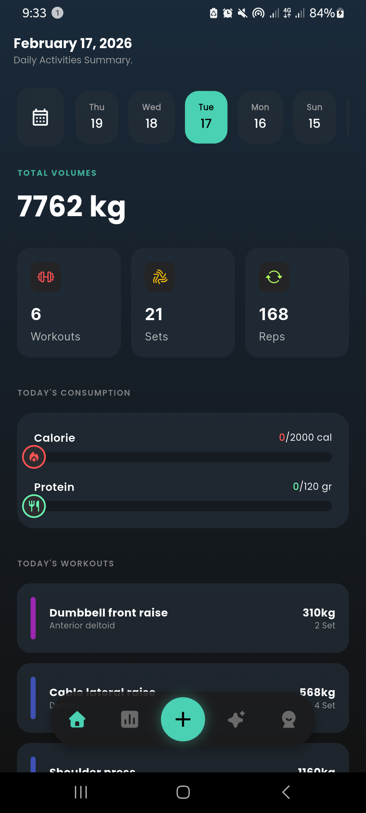
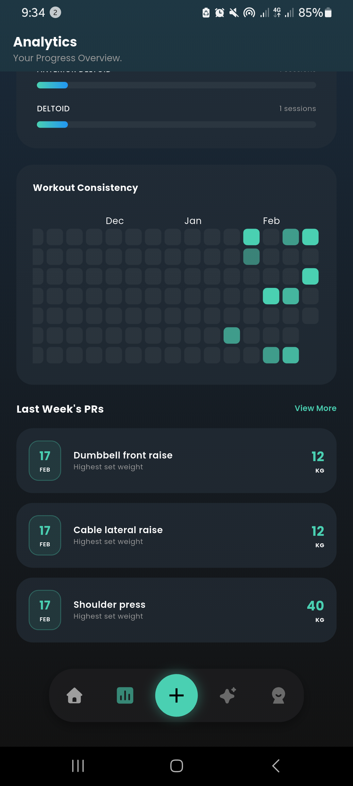
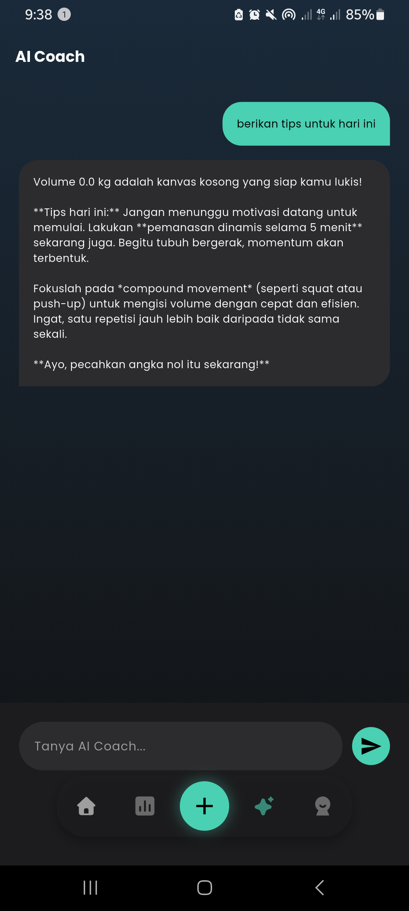
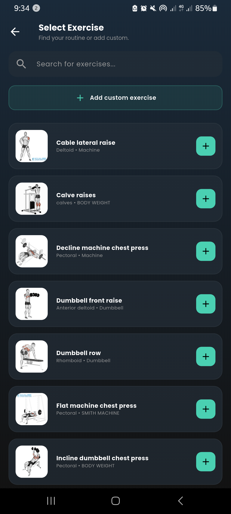
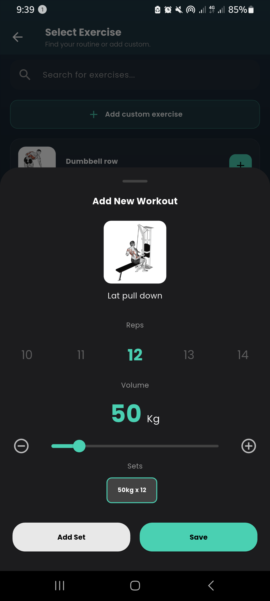

# 📱 MyFitApp (Aplikasi untuk tracking progress gym)

Aplikasi mobile untuk melakukan **monitoring progress gym**.  
Dibangun dengan **Flutter** dan **Firebase database**.

---

## 🚀 Features
- Mencatat progress harian gym termasuk jumlah kalori dan protein harian yang dikonsumsi
- Daftar latihan populer dengan gif image untuk memudahkan pengguna meniru gerakan fitness yang sesuai
- Analisis progress baik harian maupun mingguan
- Melihat personal record mingguan
- Integrasi dengan gemini ai, untuk pengguna bertanya seputar fitness (on progress)

---

## 🖼️ Screenshot
<p align="center">
  
  
  
  
  
</p>

---

## 🎥 Demo Video
<p align="center">
  <a href="https://youtu.be/GISUEjKLQgA?si=GXELMpv2vnO7fnUN" target="_blank">
    
  </a>
</p>

---

## ⚙️ Tech Stack
- **Frontend (Mobile)**: Flutter
- **Database**: Firebase

---

## 📦 Installation
```bash
# Clone repository
git clone https://github.com/AhmadSholehU/flutter_application_2.git

# Masuk ke folder project
cd flutter_application_2
```

---

## 👨‍💻 Author
- [Hendi Ahmad](https://github.com/AhmadSholehU)